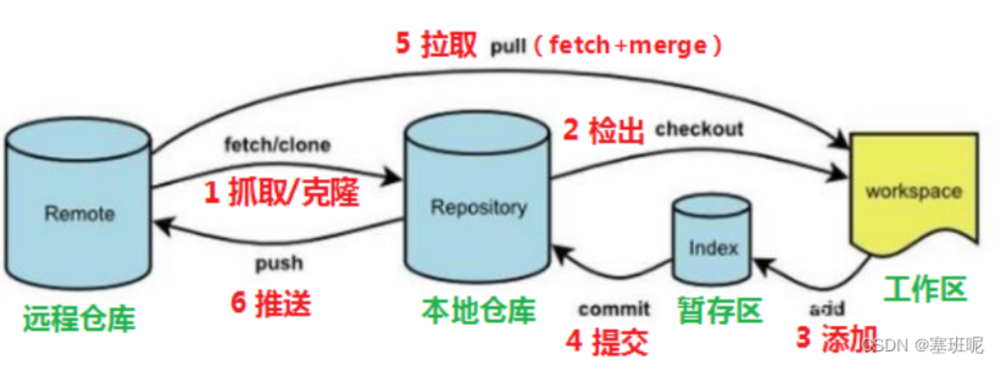

# Git（分布式版本控制工具）
## 1. 基本概论

> * Git是分布式版本控制系统（Distributed Version Control System，简称 DVCS），分为两种类型的仓库：
本地仓库和远程仓库
> * Git 是一个免费的、开源的分布式版本控制系统。可以快速高效地处理从小型到大型的各种项目。Git易于学习，占地面积小，性能极快。 它具有廉价的本地库，方便的暂存区域和多个工作流分支等特性。其性能优于 Subversion、CVS、Perforce 和 ClearCase 等版本控制工具。

### 1.1什么是版本控制？
> * 版本控制是一种记录文件内容变化，以便将来查阅特定版本修订情况的系统。
> * 版本控制其实最重要的是可以记录文件修改历史记录，从而让用户能够查看历史版本，方便版本切换。
> 
### 1.2 版本控制器的方式

### 1.2.1 CVS、SVN(Subversion)、VSS
> * 集中化的版本控制系统诸如 CVS、SVN 等，**都有一个单一的集中管理的服务器，保存所有文件的修订版本，** 而协同工作的人们都通过客户端连到这台服务器，取出最新的文件或者提交更新。多年以来，这已成为版本控制系统的标准做法。
> * 这种做法带来了许多好处，每个人都可以在一定程度上看到项目中的其他人正在做些什么。管理员也可以轻松掌控每个开发者的权限，并且管理一个集中化的版本控制系统，要远比在各个客户端上维护本地数据库来得轻松容易。
> * 事分两面，有好有坏。__这么做显而易见的缺点是中央服务器的单点故障。如果服务器宕机一小时，那么在这一小时内，谁都无法提交更新，也就无法协同工作。__

### 1.2.2  分布式版本控制工具
> * Git、Mercurial、Bazaar、Darcs…
> * 像Git这种分布式版本控制工具，客户端提取的不是最新版本的文件快照，而是把代码仓库完整地镜像下来（本地库）。这样任何一处协同工作用的文件发生故障，事后都可以用其他客户端的本地仓库进行恢复。因为每个客户端的每一次文件提取操作，实际上都是一次对整个文件仓库的完整备份。
> * 分布式的版本控制系统出现之后，解决了集中式版本控制系统的缺陷：
> * __服务器断网的情况下也可以进行开发（因为版本控制是在本地进行的）
每个客户端保存的也都是整个完整的项目（包含历史记录，更加安全）__

# 学习要点――敲黑板
## Git 工作流程

## 命令如下：

> clone(克隆): 从远程仓库中克隆代码到本地仓库

> checkout(检出):从本地仓库中检出一个仓库分支然后进行修订

> add(添加): 在提交前先将代码提交到暂存区

> commit(提交): 提交到本地仓库。本地仓库中保存修改的各个历史版本

> fetch (抓取) ： 从远程库，抓取到本地仓库，不进行任何的合并动作，一般操作比较少。

> pull (拉取) ：从远程库拉到本地库，自动进行合并(merge)，然后放到到工作区，相当于fetch+merge

> push(推送): 修改完成后，需要和团队成员共享代码时，将代码推送到远程仓库

# 敲黑板 敲 敲 敲
## 版本回退
> * 撤回到之前的某个操作，他回去删除我们撤回到位置之后的版本
>>命令形式：__git reset --hard commitID__
> * commitID 可以使用 git-log 或 git log 
>> 指令查看 git reflog ――这个指令可以看到已经删除的提交记录
## 其他
> * __码云__（地址： https://gitee.com/ ）是国内的一个代码托管平台，由于服务器在国内，所以相比于 GitHub，码云速度会更快

> * __GitLab__ （地址： https://about.gitlab.com/ ）是一个用于仓库管理系统的开源项目，使用Git作 为代码管理工具，并在此基础上搭建起来的web服务,一般用于在企业、学校等内部网络搭建git私服。

# Search on GitHub

### 要想在短时间内检索到自己想要的仓库，我们可以在搜索时加上一些限制条件，比如，仓库名(repository name)、项目描述(description)、内容(contents)、说明文件(readme.md) 来搜索项目，下面是常用的一些筛选条件。
| 搜索过滤的要素 | 语法  |
|:--------:| :---------:|
| 按照项目（仓库名称）搜索 | __in:name XXX__ |
| 按照编程语言搜索 | __language:xxx__ |
| 按照项目（仓库）描述搜索 | __in:description xxx__ |
| 按照README文件描述搜索 | __in:readme xxx__ |
| 按照star数限制搜索     | __stars:>n__ |
| 按照fork数限制搜索 | __forks:>n__ |
| 按照关注者数量搜索 | __node followers:>=10000 匹配有 10,000 或更多关注者提及文字 "node" 的仓库__ |
|按照更新时间限制（时间晚于）搜索|__pushed：>YYYY-MM-DD__|