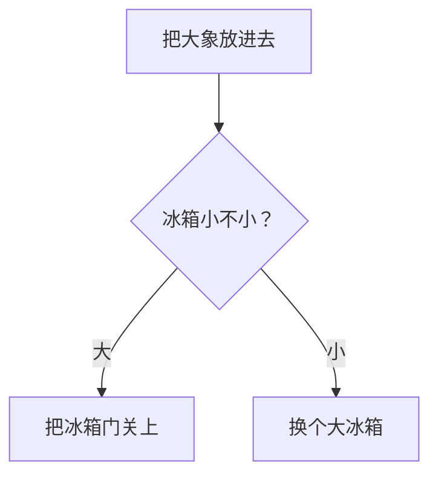

#hello world

```c
int main(int argc, char *argv) {print "hello world!");
```

    


###### 方法
重载 *（方法名字相同，传入参数不同）*
参数顺序不同也可以构成 但是不建议这样书写

 
```java
int a = 1;
int [] array = {1, 2, 3, 4, 5};
```
##  堆  存储数组内容
## 栈 存放地址  
**// 数组里面一些标准库   **
#####数组赋值注意中间变量




